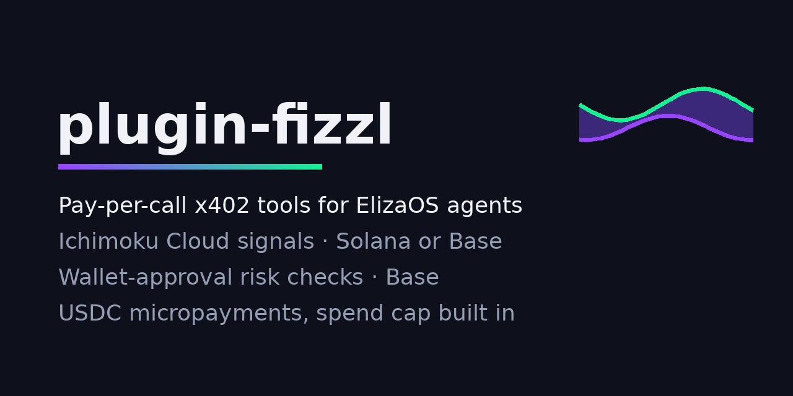

# plugin-fizzl



[](https://ichimoku-signal.onrender.com/media/plugin.mp4)

▶ [Watch the 39-second video](https://ichimoku-signal.onrender.com/media/plugin.mp4): install, then an agent answers "which coins are bullish on the 4h?" and "where would the stop go?", paying per call.

ElizaOS plugin that gives your agent 9 paid tools for crypto: trading signals, a market scan of 148 coins,
price levels with stop and targets, and safety checks before it signs or pays. Your agent pays per call in USDC on
Solana or Base over x402: no API keys, no accounts, no subscriptions.

```text
You:   Which coins are bullish on the 4h?
Agent: Market scan 4h: 98 of 148 coins bullish (98 bullish · 21 neutral · 29 bearish)
       Bullish (98): QNT +18.8% · XPL +16.1% · BP +15.7% · ONDO +14.1% · USELESS +8.94% · …
       % = price distance above (+) or below (−) the Ichimoku cloud. Not trade advice.
       Paid via x402: https://solscan.io/tx/…
```

| Action | Service | What it does | Price | Pays on |
|--------|---------|--------------|-------|---------|
| `FIZZL_ICHIMOKU_SIGNAL` | [Ichimoku Signal](https://ichimoku-signal.onrender.com) | Live Ichimoku Cloud signal for a crypto pair: bullish/bearish/neutral, cloud position, tenkan/kijun cross and all line values | $0.02 | Solana or Base |
| `FIZZL_CONFLUENCE_SIGNAL` | [Ichimoku Signal](https://ichimoku-signal.onrender.com) | Six indicators in one call (Ichimoku, RSI, MACD, EMA 50/200, Bollinger, volume), each with a vote, plus a combined signal and confidence | $0.10 | Solana or Base |
| `FIZZL_PRICE_LEVELS` | [Ichimoku Signal](https://ichimoku-signal.onrender.com) | Support/resistance, ATR, and a long/short plan with stop, two targets and risk/reward (levels, not advice) | $0.05 | Solana or Base |
| `FIZZL_MARKET_SCAN` | [Ichimoku Signal](https://ichimoku-signal.onrender.com) | The Ichimoku signal for 148 top-200 coins at once, strongest bullish first, with market breadth; "which coins are bearish" filters | $0.25 | Solana or Base |
| `FIZZL_CHECK_WALLET_APPROVALS` | [PlainText](https://smartcontractexplainer.onrender.com) | Checks an EVM wallet's live token/NFT approvals and explains the risk: SAFE / CAUTION / RISK | $0.10 | Solana or Base |
| `FIZZL_EXPLAIN_APPROVAL` | [PlainText](https://smartcontractexplainer.onrender.com) | Explains a pasted approval/permission JSON in plain language with a verdict | $0.05 | Solana or Base |
| `FIZZL_PREFLIGHT_X402` | [x402 Doctor](https://x402-doctor.onrender.com) | Before paying an unknown x402 endpoint: GO / CAUTION / NO-GO, the recommended payment option and why (would not settle, over your budget, charges more than advertised, not HTTPS, unknown token). Never pays the endpoint itself | $0.001 | Solana or Base |
| `FIZZL_PRESIGN_CHECK` | [presign-guard](https://presign-guard.onrender.com) | Before signing a transaction, token approval or EIP-712 signature (Permit, Permit2, Seaport, x402 payment): GREEN / ORANGE / RED with reason codes, for who gets access and for the token itself (honeypots, fake tokens such as a fake USDC). Only sign on green, ask a person on orange, never sign on red. Add "explain" (optionally "in Dutch") for a plain-language explanation | $0.01 ($0.03 explained) | Base |
| `FIZZL_DIAGNOSE_X402` | [x402 Doctor](https://x402-doctor.onrender.com) | Diagnoses why an x402 paid endpoint fails (challenge, accepts[], Solana settlement, Bazaar/OpenAPI discovery, paywall) with a fix hint per check. Never pays the endpoint itself | $0.01 | Solana or Base |

A `FIZZL_SERVICES` provider tells the agent which of these tools it has and which wallets pay for them.

## Install

```bash
npm install plugin-fizzl        # or: npm install github:Fizzl13/plugin-fizzl
```

```ts
import { fizzlPlugin } from "plugin-fizzl";

export const character = {
  name: "TraderBot",
  plugins: ["plugin-fizzl"],          // or pass fizzlPlugin in a project's agent plugins
  settings: {
    secrets: {
      SVM_PRIVATE_KEY: process.env.SVM_PRIVATE_KEY,   // Solana wallet with USDC
      EVM_PRIVATE_KEY: process.env.EVM_PRIVATE_KEY,   // Base wallet with USDC
    },
  },
};
```

## Settings

| Setting | Required | Default | Purpose |
|---------|----------|---------|---------|
| `SVM_PRIVATE_KEY` | for Solana | – | Solana secret key (base58 export, or the CLI's JSON byte array) with USDC. No SOL needed: the facilitator pays the fee. |
| `EVM_PRIVATE_KEY` | for Base | – | EVM private key (`0x…`) with USDC on Base. No ETH needed: payments are gasless EIP-3009 signatures. |
| `FIZZL_MAX_PAYMENT_USD` | no | `0.25` | The agent refuses any single payment above this. |
| `SOLANA_RPC_URL` | no | public mainnet RPC | RPC used to build Solana payments; the public one rate-limits. |
| `ICHIMOKU_SIGNAL_URL`, `PLAINTEXT_URL`, `X402_DOCTOR_URL`, `PRESIGN_GUARD_URL` | no | live services | Point at another deployment. |

With both keys configured, services that accept both are paid on Solana. presign-guard is paid on Base only, so it
needs `EVM_PRIVATE_KEY`. Use a **dedicated wallet** holding only what the agent may
spend; the spend cap limits a single payment, not the total.

## What the agent understands

- “What does the Ichimoku cloud say for SOL/USDT on the 4h?” → `SOL-USDT`, `4h`
- “Is $JUP above the cloud on the daily?” → `JUP-USDT`, `1d`
- “RSI, MACD and the other indicators for ETH on the 4h?” → confluence, `ETH-USDT`, `4h`
- “Where are support and resistance for BTC, and where would the stop go?” → price levels, `BTC-USDT`
- “Scan the market on the daily: which coins are strongest?” → market scan, `1d`
- “Which coins are bearish on the 4h?” → market scan, `4h`, bearish only
- “Are the NFT approvals on 0x6B0F…5F25 safe on arbitrum?” → wallet check, `arbitrum`, `nft`
- “Is this approval safe? ```json {…}```” → explain the payload
- “Is it safe to sign this? {"primaryType":"Permit","domain":{…},"message":{…}}” → presign check of the typed data
  (chain from `domain.chainId`); a transaction `{ "to", "data", "value", "chainId" }` works too

## Check before signing, in code

`FIZZL_PRESIGN_CHECK` also works as a guard in your own signing path:

```ts
import { FizzlClient, presignCheck } from "plugin-fizzl";

const client = await FizzlClient.create({ evmPrivateKey: process.env.EVM_PRIVATE_KEY });
const urls = { ichimoku: "", plaintext: "", doctor: "", presign: "https://presign-guard.onrender.com" };

const check = await presignCheck(client, urls, {
  request: { type: "signature", chainId: 8453, typedData },   // what you are about to sign
  explain: false,
  lang: "en",
});
if (!check.ok || check.data?.verdict !== "green") throw new Error("Not signing: " + (check.data?.verdict ?? check.error));
```

An error (presign-guard or a data source down) returns no verdict and costs nothing: treat it as "do not sign yet".

The LLM can also pass parameters directly (`pair`, `interval`; `address`, `chain`, `kind`; `data`; `typedData`,
`transaction` or `request`, `explain`, `lang`), which take
precedence over what is parsed from the message. Replies include the settlement transaction (Solscan/Basescan), and
the action result carries the structured response in `data` and the verdict/signal in `values` for chained actions.

## Development

```bash
npm install
npm test          # builds, then runs the tests
```

The tests pay fixture x402 services that behave like the live ones and verify every payment the way a facilitator
does: the payer's Ed25519 signature on the Solana transaction and the EIP-3009 signature on Base. They cover network
preference, the spend cap, rejected payments, missing wallets, message parsing and `validate`.

## Releasing

Publishing runs in GitHub Actions (`.github/workflows/publish.yml`) and needs an `NPM_TOKEN` repository secret: an npm granular access token with read and write access to packages.

1. Bump `version` in `package.json` and merge to `main`.
2. Tag that commit and push the tag (`git tag v0.1.1 && git push origin v0.1.1`), or run "Publish to npm" from the Actions tab on `main`.

The workflow checks that the tag matches the version, runs the tests and publishes.
